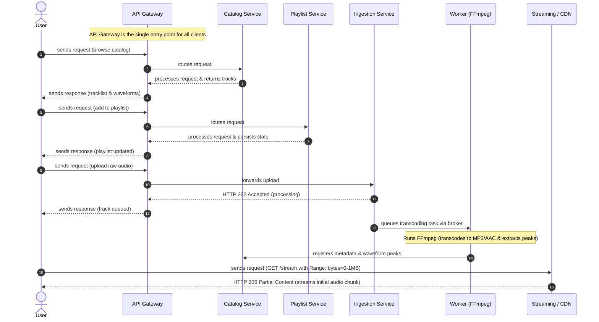

# Distributed-Event-Driven-Multimedia-Streaming-Platform.
A distributed, event-driven audio streaming platform featuring asynchronous FFmpeg ingestion, HTTP 206 partial-content streaming, and persistent client-side playback.

## Sytem Diagram
