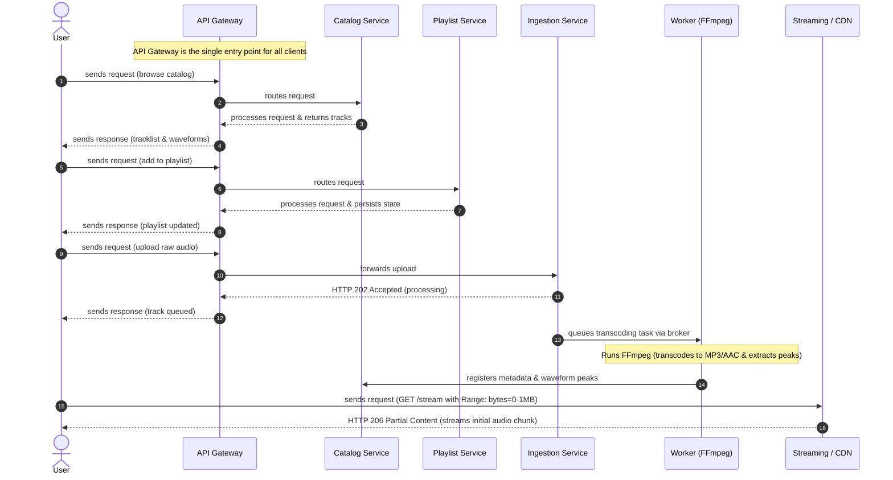

# Project Specification: Distributed Music Streaming Platform

## 1. Project Overview

This project is a distributed, web-based music library and audio streaming platform. The platform is designed using a microservices architecture to decouple lightweight, I/O-bound metadata management from compute-heavy audio transcoding and high-throughput media streaming. 

The user interface features a single-page application (SPA) with a persistent client-side audio player, enabling uninterrupted playback across internal page transitions. On the backend, an asynchronous ingestion pipeline isolates long-running multimedia workloads, utilizing worker pools to transcode audio files and extract visual waveform metrics without degrading overall API throughput.

---

## 2. System Architecture & Microservice Responsibilities

The system decouples core functionalities into discrete services:

* **API Gateway:** Serves as the single reverse proxy and traffic ingress point. Handles request routing, SSL termination, client rate limiting, and JWT authentication token verification before routing to internal private services.
* **Catalog Service:** Manages relational metadata regarding artists, albums, tracks, and genre classifications. Provides fast CRUD operations over PostgreSQL.
* **Playlist Service:** Persists user-specific states, track favorites, collection updates, and custom playlist ordering.
* **Ingestion Service:** Exposes ingestion endpoints for raw audio uploads. Offloads incoming binary payloads to cloud object storage and immediately dispatches processing messages to a broker.
* **Transcoding Worker Service:** Asynchronous worker instances consuming tasks from the message broker. Executes FFmpeg processes to convert raw master files into web-optimized streaming bitrates (e.g., AAC/MP3) and computes downsampled audio peak arrays for client waveform visualization.
* **Audio Streaming Edge / CDN:** Delivers audio chunks using HTTP 206 Partial Content range requests, allowing low-latency streaming and arbitrary seek positions without downloading whole media files into client memory.

---

## 3. End-to-End Sequence Diagram

The following sequence diagram outlines client interaction across the API gateway, domain microservices, asynchronous transcoding queue, and the CDN edge:

## 4. Key Workflows & Engineering Mechanics

### 4.1. Asynchronous Ingestion & Processing
When a raw uncompressed audio asset (e.g., WAV or FLAC) is uploaded:
1. The Ingestion Service accepts the payload, uploads it to an object storage bucket (e.g., S3/R2), and places an execution payload on the message queue[cite: 2].
2. The service responds immediately with `HTTP 202 Accepted`, preventing client connection timeouts and freeing web server threads[cite: 2].
3. Idle workers pick up the task and run FFmpeg CLI routines to transcode the source file into standard web distribution formats and downsample amplitude peaks[cite: 2].
4. Metadata and peak values are inserted into the Catalog database, making the track visible and searchable across the application[cite: 2].

### 4.2. Byte-Range Media Streaming (HTTP 206)
Audio assets are not downloaded in complete memory buffers before playback starts:
1. When playback begins, the client requests the initial byte slice using HTTP headers: `Range: bytes=0-1048575`[cite: 2].
2. The storage or CDN layer returns `HTTP 206 Partial Content` with only the first 1 MB[cite: 2].
3. The Web Audio API / HTML5 audio runtime begins playback in sub-second time.
4. When a user navigates to an arbitrary timestamp via the seekbar, a new range request with an offset byte interval is dispatched, preventing unnecessary bandwidth consumption for skipped audio segments.

### 4.3. Persistent Client-Side Audio Shell
To prevent playback stoppage when navigating between different views, routes, or albums:
* The client architecture utilizes a Single Page Application (SPA) routing mechanism.
* The playback engine and audio context remain mounted in a root layout shell outside the dynamic content router.

---

## 5. Technology Stack Summary

* **Frontend:** React, Tailwind CSS, Web Audio API / WaveSurfer.js.
* **API Gateway & Routing:** Nginx / Traefik (Reverse Proxy, CORS, SSL termination, Header forwarding).
* **Application Services:** Node.js / Express or Python / FastAPI.
* **Multimedia Processing:** FFmpeg via containerized background workers.
* **Broker & Messaging:** RabbitMQ or Redis Streams.
* **Persistence & Storage:** PostgreSQL (relational metadata), Object Storage / S3-compatible store (audio blobs), Redis (session caching). 